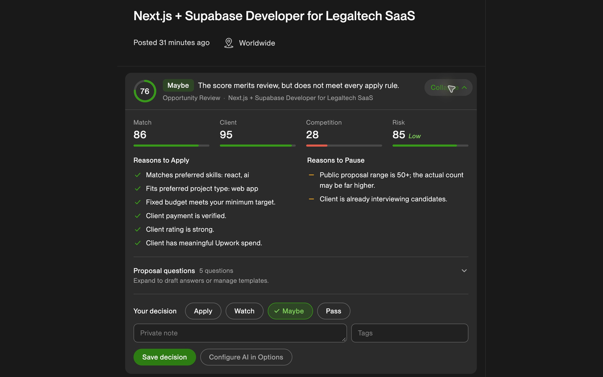

# Upwork Enhancer

Upwork Enhancer is a Manifest V3 browser extension that helps freelancers evaluate Upwork opportunities while browsing Upwork. The same extension source is packaged for Chrome and for macOS Safari.

It adds local scoring badges to job cards, shows an opportunity review panel on job detail pages, and optionally uses a user-configured OpenAI-compatible API for additional analysis.

This is an unofficial extension and is not affiliated with, endorsed by, or sponsored by Upwork.



## Features

- Scores visible Upwork jobs by match, client quality, competition, and risk.
- Adds compact action badges such as `Apply`, `Watch`, `Maybe`, and `Pass`.
- Shows a detail review panel with score breakdowns, reasons, risk notes, and saved decisions.
- Imports a visible freelancer profile into local matching preferences.
- Saves settings and decision metadata locally in browser storage.
- Supports English and Chinese extension UI text.
- Offers optional AI analysis through a user-provided API endpoint and API key.

## Privacy And Scope

The extension is designed to assist browsing decisions, not automate Upwork activity.

- It does not submit proposals automatically.
- It does not click through Upwork workflows automatically.
- It does not collect Upwork passwords.
- It does not proxy Upwork sessions.
- It does not crawl Upwork pages in the background.
- It does not send data to the developer's own server.

When optional AI is enabled, visible job context may be sent to the API endpoint configured by the user. See [Privacy Policy](docs/PRIVACY_POLICY.md) for details.

## Install For Local Testing

### Chrome / Chromium

The web extension itself has no build step.

1. Download or clone this repository.
2. Open `chrome://extensions`.
3. Enable Developer mode.
4. Click `Load unpacked`.
5. Select the repository folder.
6. Open an Upwork job list or job detail page.

The latest packaged zip is available on the [GitHub Releases page](https://github.com/dreaifekks/upwork-enhancer/releases).

### macOS Safari

With Node.js and full Xcode installed:

```bash
npm run safari:run
```

This validates the extension, generates its Xcode container, builds a local macOS app, and opens it. Enable the extension in Safari and allow access to Upwork to use it. Without a configured signing identity or team, the build uses ad-hoc signing and Safari needs **Allow unsigned extensions**. You can instead use your Apple development team or an existing Developer ID Application identity.

See [Safari setup and verification](docs/SAFARI.md) for signing, temporary loading, generated paths, and the browser QA checklist. A successful app build alone does not verify the extension inside Safari.

## Development

Requirements:

- Node.js 20 or newer
- Chrome or Chromium for manual extension testing
- macOS and full Xcode for the Safari app (command-line tools alone are insufficient)
- ImageMagick for preparing store screenshots

Useful commands:

```bash
npm run check
npm run package:extension
npm run package:safari
npm run safari:project
npm run safari:build
npm run safari:run
npm run screenshots:store
```

`npm run package:extension` creates a Chrome upload zip in:

```text
dist/chrome/
```

`npm run package:safari` creates the shared web extension folder and a zip under `dist/safari/`. The zip is suitable for temporary loading in recent Safari versions; it is not a signed macOS app or an App Store submission. `npm run safari:project` creates the native Xcode project under `build/safari/`, and `npm run safari:build` builds that app. These generated files are excluded from Git.

`npm run screenshots:store` converts real raw screenshots from:

```text
assets/store/raw/
```

into Chrome Web Store-compatible PNG files in:

```text
assets/store/screenshots/
```

## Manual QA

Before publishing a release, verify:

- Job list pages show score/action badges on visible job cards.
- Job detail pages show the opportunity review panel.
- The review panel can be collapsed and does not cover the main job title on laptop-width screens.
- Saving a decision persists the selected action, note, and tags locally.
- Options can switch extension-owned UI text between English and Chinese.
- Updating settings refreshes already-open Upwork tabs without a manual page reload.
- The extension still works when AI settings are empty or disabled.

## Project Docs

- [Product goals](docs/PRODUCT_GOALS.md)
- [MVP requirements and build plan](docs/MVP_REQUIREMENTS.md)
- [Chrome Web Store release checklist](docs/CHROME_WEB_STORE_RELEASE.md)
- [Safari setup and verification](docs/SAFARI.md)
- [Safari App Store release plan and listing draft](docs/APP_STORE_RELEASE.md)
- [Privacy policy](docs/PRIVACY_POLICY.md)

## License

Apache License 2.0. See [LICENSE](LICENSE).
